# WordClock

This is the <b>WordClock</b> software to the thingiverse project: <a href="https://www.thingiverse.com/thing:4693081">Wordclock Wortuhr</a>. Also available for download on <a href="https://www.printables.com/de/model/311949-wordclock-2022">Prusa Printables</a>.

Feel free to add functions, ideas and everything else, which helps this project to grow! 

<h3><b>Current version: 5.9     </b></h3>

Time here is 07:43 or 19:43 o'clock

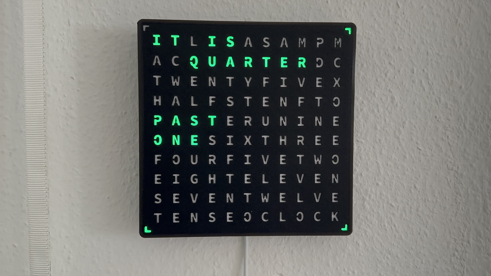

English variant available too. Time here is 01:18 or 13:18 o'clock.

<h3><b>Video:</b></h3>

Music credit: Used some free music from Apple iMovie

<h3><b>Required Hardware:</b></h3>

- Node MCU V3 - ESP8266 board
- RTC (DS3231) board (optional)
- 114 LEDs of an WS2812B led stripe 
- Powersupply 5V / >=3A

<h3><b>How to setup the Arduino IDE to support the ESP8266 and select the NodeMCU board:</b></h3>

- Please use this manual: https://randomnerdtutorials.com/how-to-install-esp8266-board-arduino-ide/

<h3><b>Available functions:</b></h3>

- Note: Check the settings.h file for the latest functions
- WiFi Manager integration to avoid setting your WiFi credentials manually in the code
- The from your WiFi router received IP-address can be shown as a scrolling text to inform you about the current value
- During startup in default a LED test function is shown to check your wiring. All LEDs should light up in green color and turn off again
- During startup a text “SET WLAN“ (DE) or “WiFi“ (EN) is shown until the WiFi settings were done for the first time or afterwards until the device received a new IP-address
- The configuraton can be set with an integrated web portal by f.e. http://WordClock0 or http://192.168.178.50 (depending on your settings)
- The LED color can be configured to a static value
- The LED intensity can be set for a day time and optional for a night mode usage
- To every new hour the hour text can flash orange to notify about the new reached hour
- Optional you can choose to show the date as scrolling text every minute + 30 seconds
- A time span can be selected to turn off the LEDs fully or reduce their intensity for night time usage for each day seperately
- Updates of the software can be done with the web portal as well to avoid connecting the device to Arduino IDE again. The needed .bin file is included
- During startup you can choose if the following functions should be displayed: IP-address as scrolling text, the SET WLAN/WiFi text and/or the LED test function
- The LED color can be shown as randomised 'rainbow' color changed every new minute or the separate words can be shown in a static rainbow color
- You can choose if the minute LEDs in the corners should be rotated in clockwise or anti clockwise direction
- The in the internal WifiManager stored WiFi settings can be set to default on request to switch to a new WiFi router afterwards
- In case the WiFi is no longer available the device will reset the WiFi settings automatically after 240s to avoid flashing with Arduino IDE again
- You can configure the hostname of the device that will be tried to tranfer to your routers DNS configuration to reach the web portal via DNS name too
- A restart request can be forced with the web portal as well
- The timezone and NTP-Server configuration can be configured as well to fit to your demands
- Optional you can set up to 3 IP-addresses (of f.e. your smart phones) connected on your network to be monitored via PING requests 2x per minute. After a set amount of failed PING attempts the WordClock LEDs will turn off to reduce power consumption when you are not at home
- Automatic update without the need of a computer. The configuration page will show the available version to update to and with a single click on the note the update will be done automatically. The download and update progress is shown on the clock display.
- Language support for german and english language in the web interface. REST command texts always written in english language. Feel free to add more languages.
- Language support for the german and english layout variant of the WordClock. The switch between the german or english layout is done by selecting the language in the web configuration.

<h3>Web configuration interface:</h3>

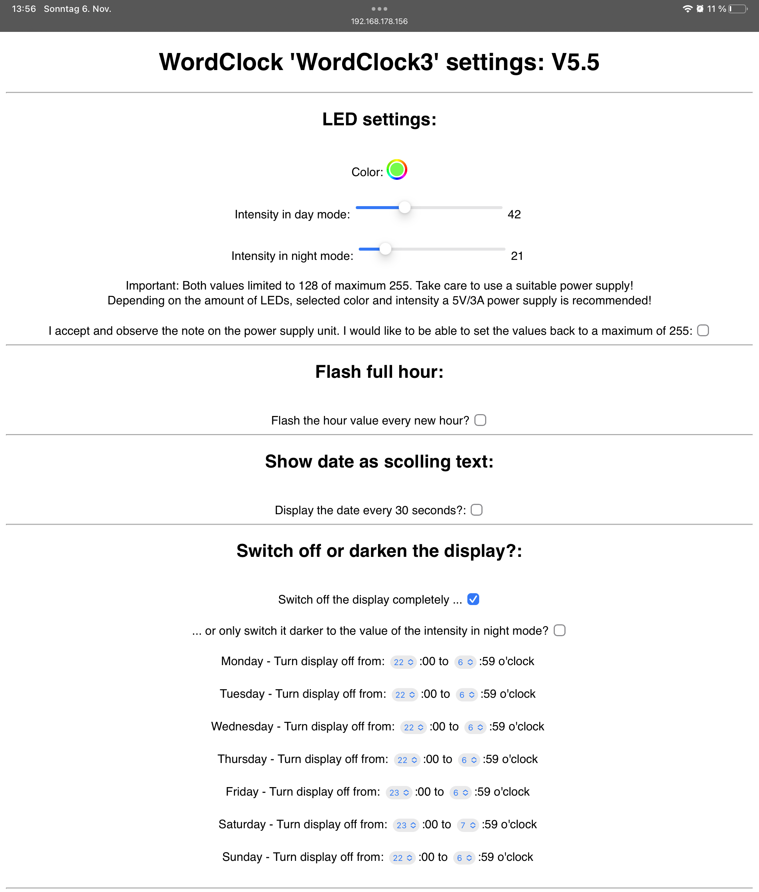
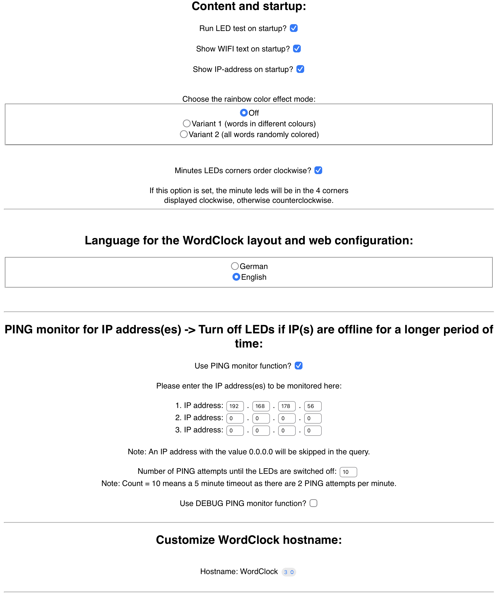
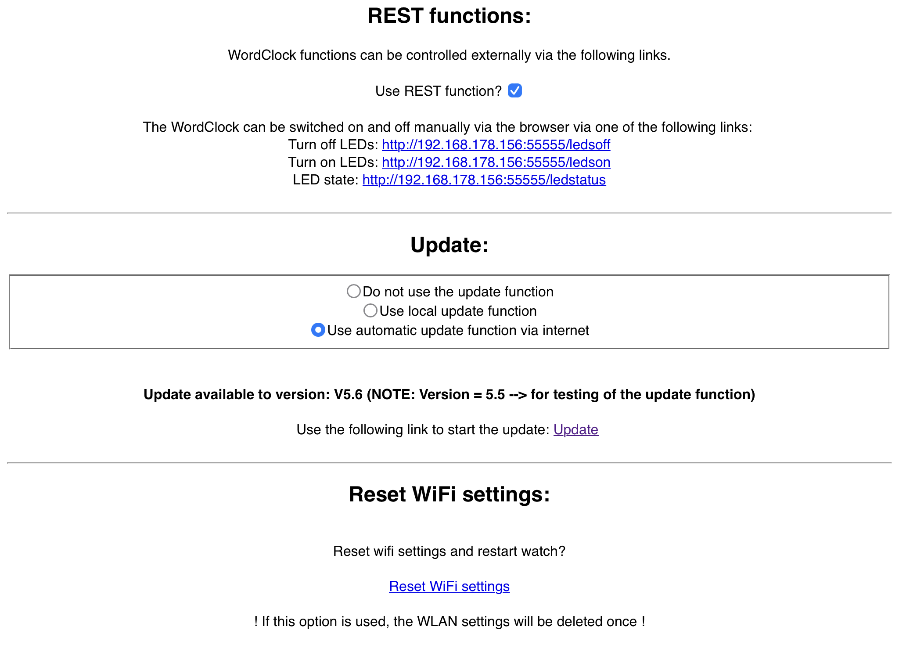
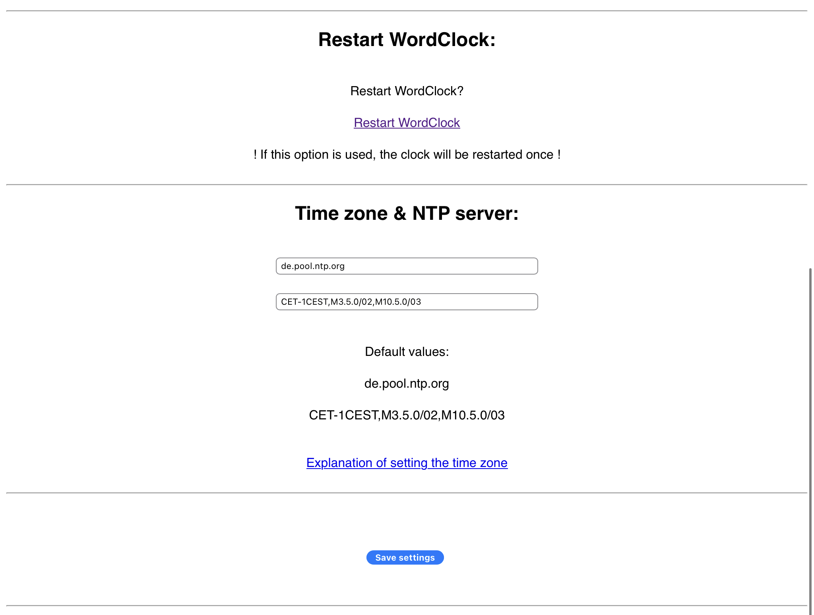

<h3>Wiring instructions:</h3>

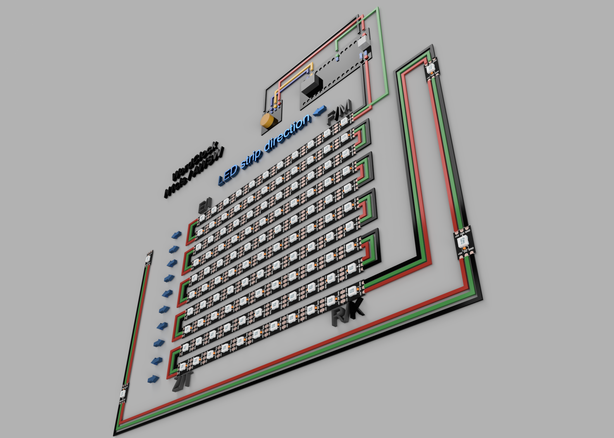

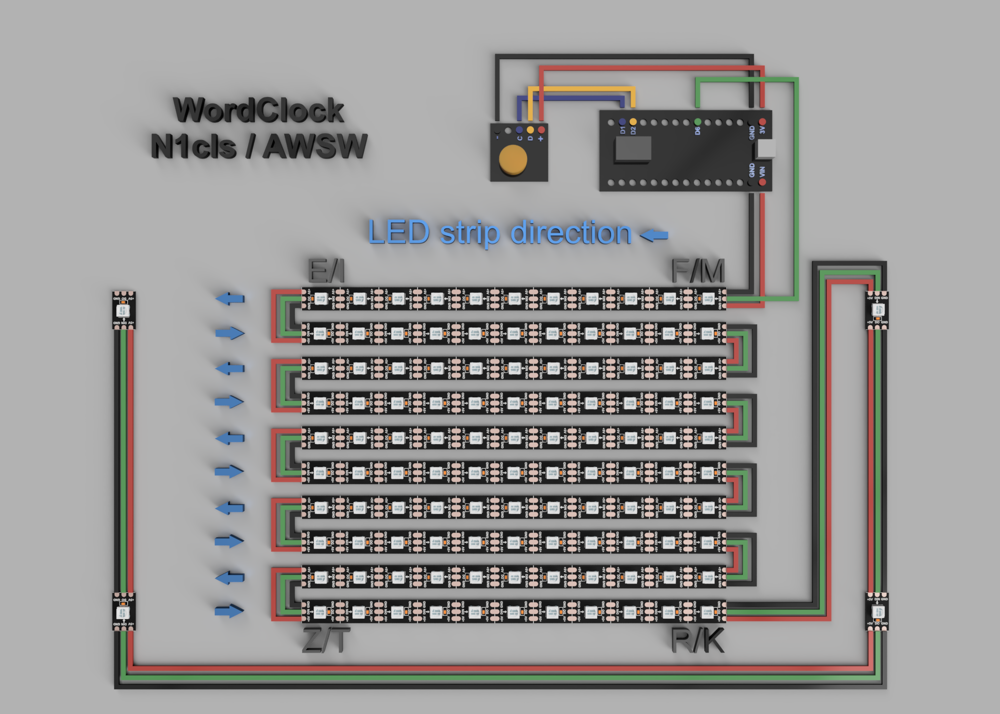

<b>Note:</b> Take care of the LED strip direction as shown in the pictures. The LEDs have little arrows that will tell you their direction:

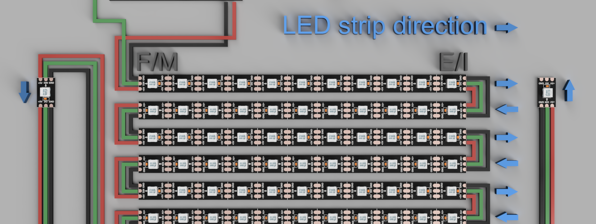

<h3><b>Version history:</b></h3>

- 1.0 to 3.4: 	Initial releases shared on thingiverse
- 3.5 to 3.9.3:	Minor function changes and code cleanup
- 4.0: 		Added an option to periodically ping a IP-address of f.e. your smart phone. 
		If the IP-address does not answer for a period of time the LEDs turn off. 
		This will allow to reduce power consumption of the WordClock when you are away.
		The ping request is done 2x every minute. So if the IP-address can be reached
		again, the LEDs will turn on after a few seconds
- 4.1: 		Minor text changes
- 4.2: 		Integrated 2 REST urls to manually turn the LEDs on or off from an external control like f.e. your smart home controller
- 4.3: 		Minor text changes. Added 2 more REST urls for an experimental twinkle mode LED test
- 4.4: 		Changed the startup LED test function to reduce power consumption to fit 5V/3A power supplies, changed the maximum setting for the brightness sliders to 128 from 255. A note for the power supply check was added. The RESET and WiFI RESET function were recreated to remove an error
- 4.5: 		Added an option to apply the power supply message and to raise the maximum LED intensity again to 255. Code cleanup. Changed the HTML page settings to show german umlauts (äöüß) now correctly.
- 4.6: 		Enhanced the PING option for now up to 3 IP-addresses that can be monitored. Code cleanup. Added another url to be able to querry the status of the LEDs.
- 4.7: 		Code cleanup. Added a small How-To to add the WordClock REST urls to HomeBridge to be able to control the WordClock from HomeKit and via Siri.
- 4.8:          Added a WiFi reconnect function in case the WiFi connection gets aborted during longer usage. Added a live update of the intensity value text fields next to the 2 sliders. Smaller changes to some functions.
- 4.9:          Added a radio button selector to switch between 2 rainbow color modes. Added a URL to get to the Wordclock repository page on GitHub.
- 5.0:		Added language support for the HTML configuration interface for english and german. German language is the default.
- 5.1:		Small bugfix for the new language support function.
- 5.2:		Optional: Automatic update without the need of a computer. The configuration page will show the available version to update to and
		with a single click on the note the update will be done automatically. The download and update progress is shown on the clock display.
		
- 5.3		Optional: Remove the need of an RTC board, because the WiFi is always connected for the configuration page access of the WordClock. No configuration needed. If there is no RTC detected a note is shown until the configuration page is saved once. Tested with and without an RTC on a WordClock.
- 5.4			BugFix to version 5.3 when no RTC board is used the current time was not updated every minute.
- 5.5			Added language support for the english layout variant of the WordClock. The switch between the german or english layout is done by selecting the language in the web configuration.
- 5.6          Version 5.6 was used for software update tests from 5.5 to 5.5 and will not be released, because it was 5.5
- 5.7          Thanks to a user feedback the english time texts could be updated to a more propper english.
- 5.8          Added a DE special function: Change between "VIERTEL VOR" = "0" and "DREIVIERTEL" = "1" in settings.h possible
- 5.9          Added a DE special function from V5.8 to web interface in German language setting. 2 small bug fixes that prevented changes to color and intensity settings when the Day/Night mode setting was turned on.

<h3><b>Upcomming and planned functions:</b></h3>

- Currently no further features planned... Working on an <a href="https://www.printables.com/de/model/331012-wordclock-16x16-led-matrix">ESP32 version with a 16x16 LED matrix and more smart home integration</a> as well as on a <a href="https://www.printables.com/de/model/350568-wordclock-16x16-led-matrix-2023">ESP32 version with a 16x16 LED matrix without smart functions (2023)</a> to minimize soldering work to just 3 wires and to have more performance for more features. The here used ESP8266 board really gets to its limits in some cases already...

<h3><b>How-To's:</b></h3>

<b>Add WordClock to Homebridge and control it with HomeKit and via Siri in your smart home:</b>

<b>Note:</b>
- The here meantioned REST url functions will work similar f.e. in HomeAssistant or other solutions too.

<b>Preconditions:</b>
- Your smart home alreday runs "HomeBridge" (https://homebridge.io) and the here shown "Homebridge UI" plugin (https://github.com/oznu/homebridge-config-ui-x) to add the configuration via web interface.

<b>Setup:</b>
- In HomeBridge add the following plugin "Homebridge Http Switch" (https://github.com/Supereg/homebridge-http-switch) 

- After the installation the "Homebridge Http Switch" plugin will be shown:
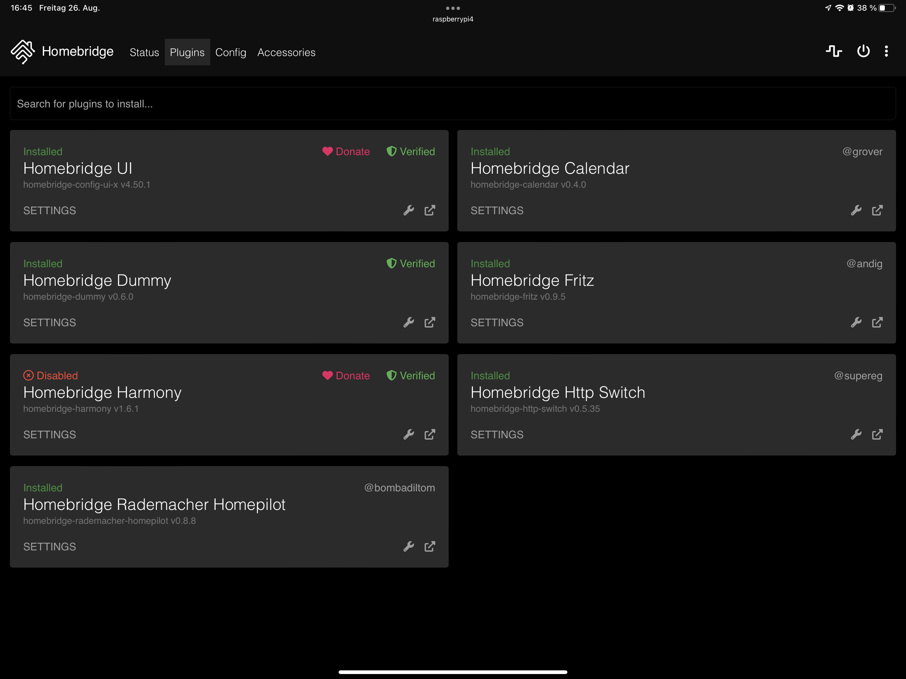

- Configure its "Settings" and add the WordClock as a new "Accessory": 
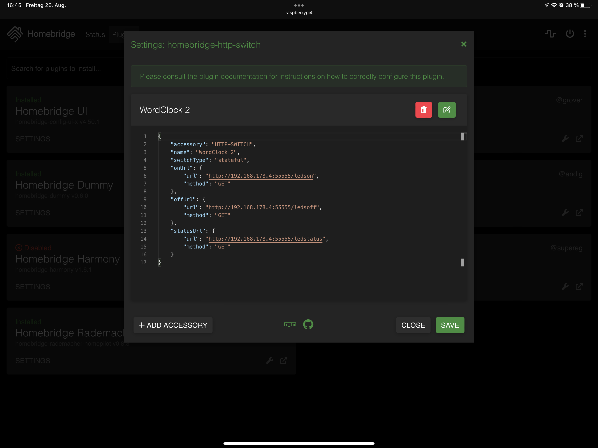

- Add the following code to the accessory after changing the value "WordClockIP" to your WordClock IP-address as well as the "name" value:

<pre><code>
{
    "accessory": "HTTP-SWITCH",
    "name": "WordClock 2",
    "switchType": "stateful",
    "onUrl": {
        "url": "http://WordClockIP:55555/ledson",
        "method": "GET"
    },
    "offUrl": {
        "url": "http://WordClockIP:55555/ledsoff",
        "method": "GET"
    },
    "statusUrl": {
        "url": "http://WordClockIP:55555/ledstatus",
        "method": "GET"
    }
}

</code></pre>

- Save the changes and use the HomeBridge UI control to restart HomeBridge.

- After the HomeBridge restart your WordClock can be controlled to turn the LEDs OFF and ON in HomeBridge, HomeKit, automation scenarios and via Siri:
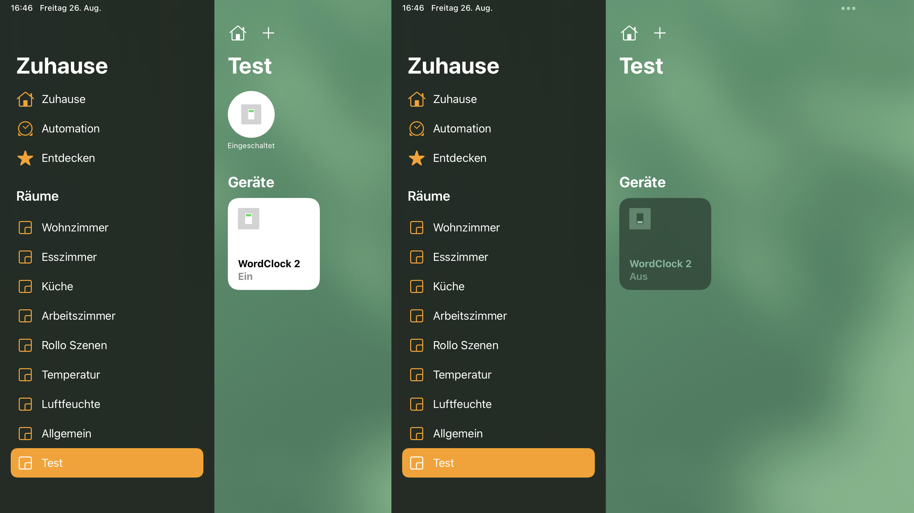

