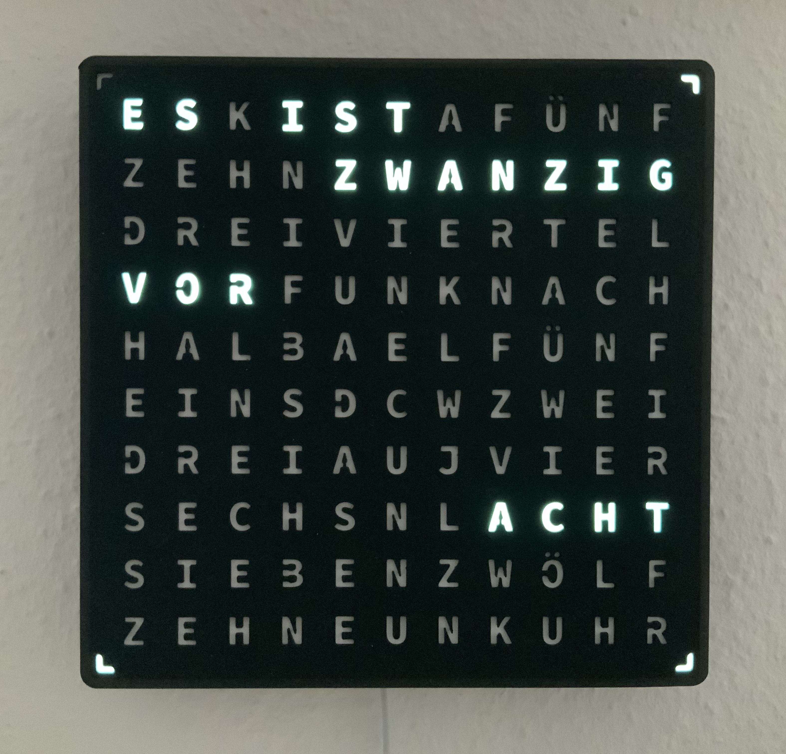

# Wordclock

This is the Wordclock software to the thingiverse project https://www.thingiverse.com/thing:4693081 

Feel free to add functions, ideas and everything else, which helps this project to grow! 

Current version: 4.0

Version history:
- 1.0 to 3.4: 	Initial releasese shareed on thingiverse
- 3.5 to 3.9.3:	Minor function changes and code cleanup
- 4.0: 		Added an option to periodically ping a IP-address of f.e. your smart phone. 
		If the IP-address does not answer for a period of time the LEDs turn off. 
		This will allow to reduce power consumption of the WordClock when you are away.
		The ping request is done 2x every minute. So if the IP-address can be reached
		again, the LEDs will turn on again.
